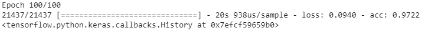
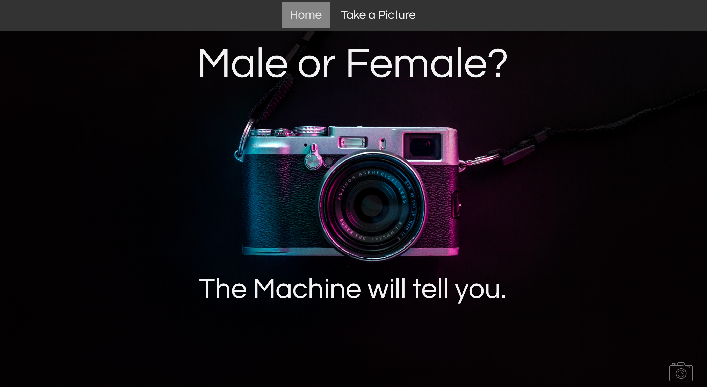
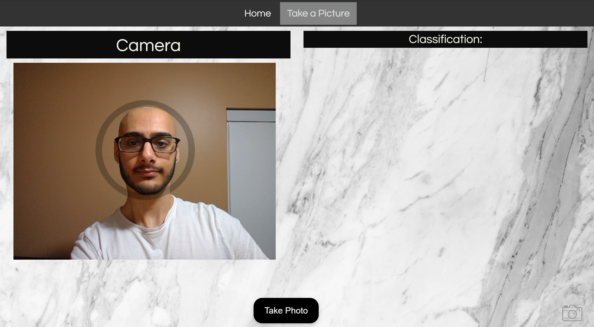

# Say-Cheese
The goal of this project was to live Identify users’ gender from front camera using a CNN. The CNN model was trained using 150,000 pictures of males and females to achieve an accuracy of 98% and ~0.1 loss. First the pictures were converted to arrays using OpenCV. 

You can find the code here ('Model/convo1.ipynb')

Google Colab was used to train the model. Three dense layers were used along with 100 epochs. 

The image above shows the accuracy accuired. 

<<<<<<< HEAD

=======
>>>>>>> 2e50d62e3e3afa5d76728943e50aec060c1f8fb5

Homepage of the applciation

Once you take a photo, the results pop up under classification. The image is converted to an array and sent to thepython flask app. The image is analysed by the model and the results are sent back to the html to be displayed. 

Technology used: Python, TensorFlow, CNN, RESTful API, OpenCV, JS, HTML, CSS
